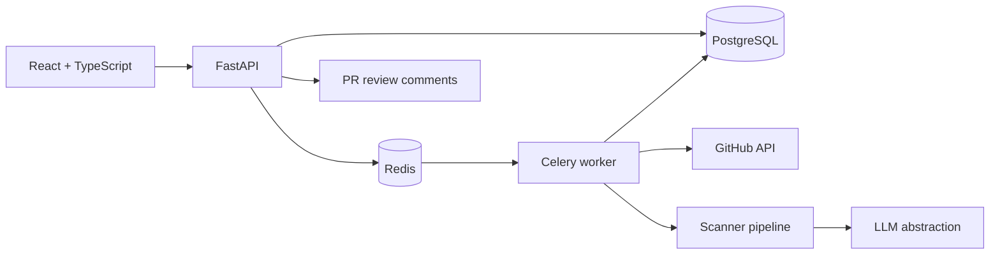

# CodeGuardian — AI-Powered Code Intelligence Platform

CodeGuardian is a GitHub-ready developer platform that turns repository scans into useful engineering decisions. It combines deterministic static rules with an LLM reasoning boundary, scores repository health, shows exact code locations, and can publish selected findings as pull-request review comments.


## What it does

- Connects GitHub repositories and enumerates branches.
- Runs asynchronous, durable analyses using FastAPI, Celery, Redis, and PostgreSQL.
- Detects hardcoded secrets, SQL-injection patterns, insecure dynamic execution, disabled TLS validation, vulnerable dependency demonstration versions, high complexity, generic naming, deferred work, duplication, and architecture boundary violations.
- Returns every finding with file, line, severity, confidence, explanation, code snippet, and suggested fix.
- Presents quality, security, maintainability, architecture, technical-debt, severity, and issue-trend views in a responsive React dashboard.
- Publishes selected findings as GitHub pull-request review comments.

## Architecture



The analysis pipeline is intentionally modular:

```text
Repository ingestion → language detection → static analysis → dependency analysis
  → security scanning → code-quality analysis → architecture analysis
  → LLM reasoning abstraction → immutable report generation
```

Read the [architecture decisions](docs/architecture.md) and [operations runbook](docs/operations.md) for scaling and incident guidance.

## Quick start

Prerequisites: Docker Desktop and a GitHub token with **Contents: Read**. Add **Pull requests: Write** to publish PR comments.

```bash
git clone <your-fork-url> codeguardian
cd codeguardian
cp .env.example .env
# Set SECRET_KEY and GITHUB_TOKEN in .env
docker compose up --build
```

Open the dashboard at `http://localhost:5173`, create an account, connect `owner/repository`, select a branch, and run an analysis. Open API documentation at `http://localhost:8000/docs`.

For local development without Docker:

```bash
# Terminal 1
cd backend
python -m venv .venv
# Windows: .venv\Scripts\activate  |  macOS/Linux: source .venv/bin/activate
pip install -r requirements-dev.txt
uvicorn app.main:app --reload

# Terminal 2 (requires Redis)
cd backend
celery -A app.workers.celery_app worker --loglevel=INFO

# Terminal 3
cd frontend
npm install
npm run dev
```

## Configuration

| Variable | Purpose |
| --- | --- |
| `DATABASE_URL` | PostgreSQL SQLAlchemy connection string. SQLite is the local fallback. |
| `REDIS_URL` | Celery broker/result backend. |
| `SECRET_KEY` | JWT signing key; must come from a secret manager in production. |
| `GITHUB_TOKEN` | GitHub token or app-installation token used for snapshots/reviews. |
| `GITHUB_API_URL` | GitHub Enterprise API endpoint override. |
| `LLM_PROVIDER`, `LLM_API_KEY`, `LLM_MODEL` | Reserved provider configuration for a validated explanation implementation. |
| `CORS_ORIGINS` | Comma-separated permitted web origins. |

## Severity and scoring

| Severity | Meaning | Default remediation estimate |
| --- | --- | --- |
| `CRITICAL` | Credible immediate compromise/exposure risk | 120 min |
| `HIGH` | Significant exploitable or operational risk | 60 min |
| `MEDIUM` | Material maintainability or architecture risk | 30 min |
| `LOW` | Improvement opportunity | 10 min |
| `INFO` | Informational signal | 5 min |

Scores start at 100 and are reduced using weighted findings. They are directional health indicators, not compliance attestations.

## API surface

All product endpoints are versioned under `/api/v1` and use bearer JWT authentication except registration/token exchange and health.

| Method | Endpoint | Description |
| --- | --- | --- |
| `POST` | `/auth/register` | Create a workspace user and receive a token. |
| `POST` | `/auth/token` | Exchange credentials for a token. |
| `GET/POST` | `/repositories` | List or connect GitHub repositories. |
| `GET` | `/repositories/{id}/branches` | Fetch selectable GitHub branches. |
| `POST` | `/analyses/repositories/{id}` | Queue an asynchronous branch analysis. |
| `GET` | `/analyses/{id}` | Retrieve scores, status, and findings. |
| `POST` | `/analyses/{id}/pull-request-review` | Publish selected findings to a PR. |

The API supplies OpenAPI documentation and applies a default 120 request/minute in-process rate limit. Use a Redis-backed gateway limiter when running more than one API process.

## Quality controls

GitHub Actions runs backend Ruff/tests and frontend type/build validation on every pull request and `main` push. Run the same checks locally:

```bash
cd backend && ruff check app tests && pytest -q
cd frontend && npm run lint && npm run build
```

## Extension points

`backend/app/analysis/` is the scanner boundary. Add richer analyzers (Semgrep, CodeQL, OSV, SCA vendors) behind this interface. `analysis/llm.py` is the reasoning boundary: production providers should use structured JSON output validated against a schema, redact secrets, record provider/version metadata, and preserve the deterministic fallback.

## Repository layout

```text
backend/app/analysis/       detector rules, scoring, and LLM abstraction
backend/app/api/            authenticated REST contract
backend/app/integrations/   GitHub gateway
backend/app/workers/        Celery queue consumer
frontend/src/               dashboard and API client
docs/                       architecture and operations documentation
.github/workflows/          CI
```

## Security notes

Never commit `.env` or GitHub tokens. The built-in scanner is a useful developer signal, not a replacement for secure code review or a continuously updated vulnerability feed. Read [SECURITY.md](SECURITY.md) for reporting guidance.

## License

This project is ready for you to add your organization’s license and ownership notice before publishing.

