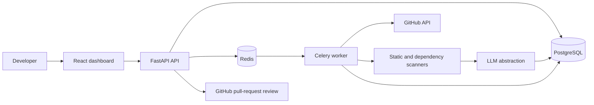

# Architecture

CodeGuardian isolates HTTP request handling from long-running repository analysis. PostgreSQL is the system of record; Redis carries background work and backs the rate limiter.

## Analysis lifecycle

1. A user connects an owner/repository pair and chooses a branch.
2. The API creates a queued analysis and sends its id to Celery.
3. The worker fetches a repository snapshot through the GitHub gateway (or accepts an injected snapshot in local development).
4. The pipeline detects languages, scans source and dependencies, calculates scores, enriches findings with explanation/fix text, and stores an immutable report.
5. The dashboard polls the analysis endpoint. Users can publish eligible findings as GitHub pull-request comments.

## Boundaries and scaling

The scanner interface permits Semgrep, CodeQL, OSV, or enterprise analyzers to replace the built-in deterministic rules. Workers are horizontally scalable because a job uses only its analysis id and durable data. At higher scale, move repository blobs to object storage, use GitHub webhooks to enqueue incremental analysis, and rate-limit per GitHub installation rather than per token.

